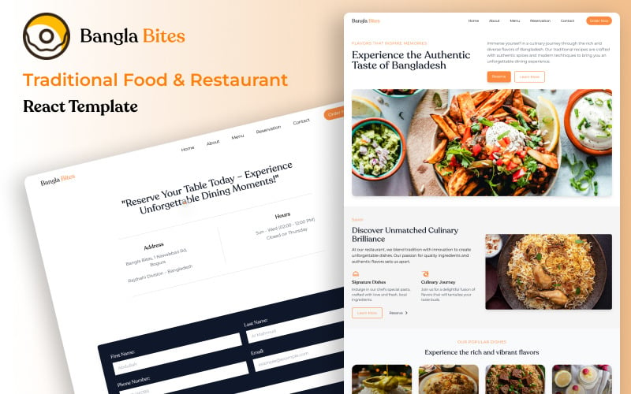

# Bangla Bites React Traditional Food Restaurant Template
Bangla Bites is a modern React-based restaurant website template crafted with **React**, **Tailwind CSS**, and **Framer Motion**.   It’s perfect for traditional food restaurants, cafes, and eateries that want a vibrant and professional online presence.

---

## ✨ Features

- ⚛️ Built with React (Vite setup)
- 🎨 Styled using Tailwind CSS
- 💫 Smooth Framer Motion animations
- 📱 Fully responsive layout
- 🧩 Reusable, modular components
- ⚡ Fast performance & clean structure
- 📘 Easy to customize with clear documentation

---

## 🖼️ Preview

---

## 🌍 Live Demo

🔗 [View on TemplateMonster](https://demo.templatemonster.com/demo/486309.html?_gl=1*psd59z*_ga*ODA1ODc3NjM3LjE3NTY1MzQzMDg.*_ga_FTPYEGT5LY*czE3NTk4MTU4MTckbzExOCRnMSR0MTc1OTgxOTE1MSRqNTIkbDAkaDA.)

---

## 💡 About This Template

Bangla Bites includes everything a restaurant website needs — a stylish hero section, featured dishes, menu highlights, customer testimonials, and a clean contact page.  
It’s designed to give developers and restaurant owners a quick, beautiful starting point for building food-based websites with React.

---

## 🧰 Tech Stack

- React  
- Tailwind CSS  
- Framer Motion  
- React Router DOM  
- Swiper.js (for sliders)

---

🛒 [Get Full Version → Bangla Bites on TemplateMonster](https://www.templatemonster.com/website-templates/bangla-bites-react-traditional-food-restaurant-template-486309.html)
